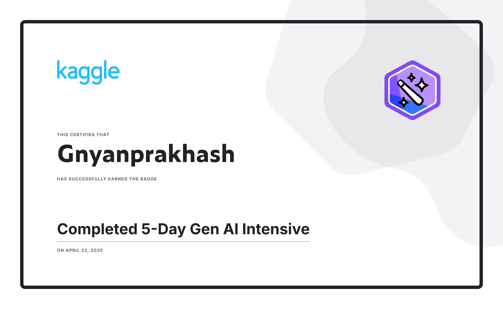

# 🚀 Content Studio Pro  
**AI-powered multi-platform content generation engine built using Google Gemini | Gen AI Capstone 2025**

Content Studio Pro is a **modular, production-grade AI system** that generates high-quality content for multiple platforms.  
It demonstrates practical implementation of **Generative AI**, structured **Prompt Engineering**, and scalable **software architecture** in real-world applications.

---

## 🏅 Google 5-Day Generative AI Intensive – Completion Badge

<p align="center">
  <a href="https://www.kaggle.com/certification/badges/gnyanprakhash/96">
    
  </a>
</p>

This project was developed as part of the Google Generative AI Intensive Program hosted on Kaggle.

## 📌 Overview

Content Studio Pro enables automated content creation for:

| Content Type | Purpose |
|--------------|---------|
| 🎥 YouTube Scripts | Full video scripts with structured sections, engagement hooks, and call-to-actions. |
| 📸 Instagram Captions | Short, creative captions tailored to image mood and trends. |
| 📝 Blog Articles | SEO-friendly, structured blog posts with headings and highlights. |
| 📢 Brand Advertisement Scripts | Marketing copy with persuasive tone and optimized CTA. |
| 🏢 Corporate Communication | Professional scripts for internal and external business communication. |
| 🎬 Movie Concepts & Screenplay | Story outlines, scene structures, and character-driven plots. |
| 💼 LinkedIn Thought Leadership Posts | Professional content aligned with brand voice. |
| 🎨 AI Image Generation Prompts | High-detail prompts for AI image synthesis tools. |

### 🎯 Key Project Goals

- Demonstrate real-world **Generative AI applications**
- Apply **structured prompt engineering** for controlled outputs
- Design **scalable, maintainable software architecture**
- Showcase production-ready Python architecture for portfolios

---

## 🏗 Project Architecture

```text
Content-Studio-Pro/
│
├── app/
│   ├── config.py                   # Central configuration: API keys, model selection
│   ├── youtube_generator.py        # YouTube script generation module
│   ├── instagram_generator.py      # Instagram caption generator
│   ├── blog_generator.py           # Blog article generator
│   ├── ad_generator.py             # Brand advertisement generator
│   ├── corporate_generator.py      # Corporate communication generator
│   ├── movie_generator.py          # Movie concept & screenplay generator
│   ├── linkedin_generator.py       # LinkedIn content generator
│   └── image_prompt_generator.py   # AI image prompt generator
│
├── main.py                         # CLI entry point
├── requirements.txt                # Python dependencies
├── .gitignore
└── README.md
```

---

## 📝 Architecture Explanation

### 🔹 Modular Architecture

Each content type has its own dedicated generator module.

**Why this matters:**

- ✅ Separation of concerns  
- ✅ Easy debugging and testing  
- ✅ Scalable (add new modules without breaking existing ones)  
- ✅ Clean, professional codebase  

---

### 🔹 Main Entry Point (`main.py`)

`main.py` acts as the **Controller Layer** of the application.

Responsibilities:

- Provides an interactive **Command Line Interface (CLI)**
- Accepts user input
- Routes requests to the correct generator module
- Displays AI-generated output

This follows a simple **controller-service pattern**.

---

### 🔹 Configuration Layer (`config.py`)

`config.py` centralizes:

- API key loading
- Gemini client initialization
- Model selection

Example:

```python
import os
from gemini import GeminiClient

API_KEY = os.getenv("GOOGLE_API_KEY")
client = GeminiClient(api_key=API_KEY)
model = "gemini-flash-latest"
```

### 🔐 Security Design

- API keys are stored in `.env`
- `.env` is excluded via `.gitignore`
- No hardcoded secrets in source code

This ensures **secure production practices**.

---

## ⚙️ Core Logic & Design Principles

### 1️⃣ Modular Generator Functions

Each module exposes a structured function:

```python
def generate_youtube_script(topic: str, duration: int) -> str:
    """
    Generates a structured YouTube script.

    Parameters:
    - topic (str): Subject of the video
    - duration (int): Length in minutes

    Returns:
    - str: Script formatted with Intro, Body, Conclusion
    """
```

### Benefits:

- Predictable input/output
- Easy integration into UI or API later
- Consistent output formatting

---

### 2️⃣ Prompt Engineering Strategy

The system uses structured prompts to control AI output quality.

#### Techniques Used:

- 🎭 Role-based prompting  
- 🧱 Structured formatting (Intro, Body, CTA)  
- 📱 Platform-specific tone optimization  
- 📢 Call-to-action reinforcement  
- 🎨 High-resolution descriptive prompts for image generation  

Example:

```
You are a professional YouTube content creator. 
Generate a 10-minute script on "AI in Education" with:

- Engaging introduction
- 5 main points with examples
- Call-to-action
- Conversational tone
```

---

### 3️⃣ AI Model Selection

```python
model = "gemini-flash-latest"
```

#### Why this model?

- Fast inference
- High-quality text generation
- Multi-modal capability
- Suitable for real-time CLI usage
- Free-tier friendly

---

## 🚀 Installation & Usage

### 1️⃣ Clone Repository

```bash
git clone https://github.com/yourusername/content-studio-pro.git
cd content-studio-pro
```

### 2️⃣ Install Dependencies

```bash
pip install -r requirements.txt
```

### 3️⃣ Configure Environment

Create `.env` file:

```bash
GOOGLE_API_KEY=your_api_key_here
```

### 4️⃣ Run the Application

```bash
python main.py
```

Follow the CLI prompts to generate content.

---

## 🧠 Technical Concepts Used

| Concept | Explanation |
|----------|------------|
| Generative AI | AI models generate original content from prompts |
| Prompt Engineering | Structured instructions to guide AI output |
| Modular Architecture | Independent modules for scalability |
| API Integration | Programmatic interaction with Gemini API |
| Environment Variables | Secure storage of credentials |
| CLI Design | Interactive terminal-based application |

---

## 📈 Future Enhancements

- 🌐 Streamlit Web UI
- 💾 Auto-save output to files / PDF
- 🔊 Text-to-Speech integration
- 🎯 SEO optimization module
- ☁ SaaS deployment
- 🔄 Multi-model switching support

---

## 🎓 Academic & Portfolio Value

This project demonstrates:

- Real-world LLM API integration
- Professional Python architecture
- Practical prompt engineering
- Production-ready project structure

### Ideal For:

- GenAI Capstone Projects
- AI/ML Portfolio
- Resume Projects
- Hackathons
- Internship Applications

---

## 📄 License

MIT License

---

## 👤 Author

**Gnyan19**  
- Built with Generative AI 🚀
- If you found this project helpful, feel free to ⭐ star the repository.
